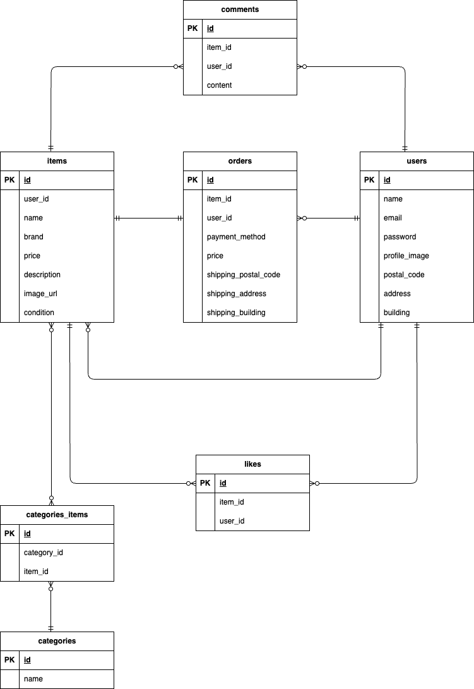

【アプリ名】
coachtech フリマアプリ

【アプリの概要】
アイテムの出品と購入を行うためのフリマアプリ。
カテゴリー検索、いいね、コメント等のフリマアプリの基本機能を一通り搭載。

【使用技術】
・Backend: PHP 8.5.1 / Laravel:12.x
・Frontend: HTML5 / CSS3
・Database: MySQL:9.6.0
・Infrastructure: nginx:1.29.4 / Docker:29.4.0 / docker-compose
・Mail Test: MailHog
・Payment: Stripe API

【環境構築】
・git clone {https://github.com/ma-mmaru/flea-market.git}
・cd flea-market
・cp .env.example .env
・docker compose up -d --build
・docker compose exec php bash
・composer install
・php artisan key:generate
・php artisan migrate
・php artisan db:seed

【開発環境】
<一般画面・商品関連>
・商品一覧画面: http://localhost
    ・マイリスト表示: http://localhost/?tab=mylist
・商品詳細画面: http://localhost/item/{item_id}
・商品出品画面: http://localhost/sell
・商品購入画面: http://localhost/purchase/{item_id}
    ・住所変更: http://localhost/purchase/address/{item_id}
<ユーザー認証>
・会員登録画面: http://localhost/register
・ログイン画面: http://localhost/login
<マイページ関連>
・プロフィール画面: http://localhost/mypage
・プロフィール編集画面: http://localhost/mypage/profile
<開発ツール>
・MailHog: http://localhost:8025
・phpMyAdmin: http://localhost:8080
・Stripe API: '.env'に自身のテスト用APIキーを設定することで動作可能(テスト用カード番号'4242 4242 4242 4242'を使用して決済テストが可能)

[要件シート](https://docs.google.com/spreadsheets/d/1szL-Q1mv_BRmzpPL1kTtfVt8lTy99g3byT0MiVUusNE/edit?gid=1909938334#gid=1909938334)
